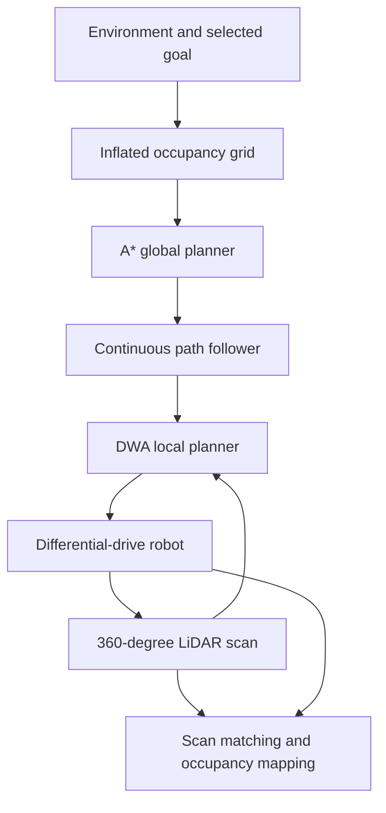

# Hybrid LiDAR Navigation and Live Occupancy Mapping for a Mobile Robot

## Project overview

This MATLAB project simulates autonomous navigation for a differential-drive
mobile robot in a cluttered two-dimensional environment. The navigation stack
combines **A\* global path planning**, **continuous look-ahead path following**,
**LiDAR-based Dynamic Window Approach (DWA) local control**, and **live
log-odds occupancy mapping**.

The robot accepts a user-selected destination, computes a collision-free global
route, follows that route with dynamically feasible velocity commands, avoids
obstacles using simulated 360-degree LiDAR data, and builds a live occupancy
map while moving.

**Portfolio focus:** autonomous mobile robots, motion planning, local control,
LiDAR perception, occupancy-grid mapping, differential-drive kinematics, and
quantitative navigation evaluation.


## Key technical features

- Safety-inflated binary occupancy-grid generation
- Toolbox-free 8-connected A\* search with diagonal corner-cut prevention
- Greedy line-of-sight path simplification and uniform path resampling
- Continuous segment projection and monotonic arc-length path progress
- Speed-adaptive look-ahead target selection
- Cross-track correction and curvature-aware speed reduction
- Dynamic Window Approach with reachable velocity sampling
- Predicted-trajectory safety, braking, clearance, and route-lock checks
- Exact 360-degree LiDAR ray casting against walls, rectangles, polygons, and
  circles
- Noisy differential-drive odometry prediction and local correlative scan
  matching
- Log-odds free-space and occupied-cell mapping using Bresenham ray traversal
- Automatic A\* replanning after excessive path error or insufficient progress
- Terminal goal controller for final docking when the direct corridor is clear
- Navigation metrics, performance plots, occupancy-map export, and video output

## Robotics and automation relevance

This project demonstrates the integration of several subsystems commonly used
in autonomous robotics:

- **Perception:** simulated LiDAR produces range measurements and obstacle hit
  points from robot-centered scans.
- **Global planning:** A\* provides environment-level connectivity around large
  obstacle groups.
- **Local planning and control:** DWA selects safe linear and angular velocity
  commands within acceleration and velocity limits.
- **Localization and mapping:** noisy odometry, local scan matching, and a
  log-odds inverse sensor model produce a live occupancy map.
- **Path tracking:** continuous geometric projection reduces dependence on
  discrete waypoint spacing.
- **Safety engineering:** trajectory rejection, stopping-distance checks,
  obstacle inflation, route locking, and a physical collision guard provide
  multiple safety layers.
- **System evaluation:** navigation accuracy, clearance, mission time, travel
  distance, and replanning frequency are exported for analysis.

## System architecture



## Navigation pipeline

### 1. Environment and goal selection

The simulated world contains boundary walls, rectangular obstacles, cylindrical
obstacles, irregular polygons, and reproducibly generated random obstacles. A
destination is selected interactively and checked against the robot footprint
and obstacle geometry.

### 2. Global path planning

The environment is converted into a binary occupancy grid. Obstacle inflation
accounts for the robot radius and an additional planning margin. An
8-connected A\* search computes a route while preventing diagonal movement
through blocked corners.

### 3. Path post-processing and tracking

The raw A\* route is simplified only when the full connecting segment remains
collision-free. It is then uniformly resampled. During navigation, the robot is
projected onto nearby path segments and progress is stored as a non-decreasing
arc-length value.

### 4. Dynamic Window Approach

At every control cycle, DWA samples dynamically reachable linear and angular
velocities, predicts the corresponding trajectories, rejects unsafe candidates,
and selects the highest-scoring command. The score considers heading, progress,
clearance, velocity, smoothness, braking safety, goal proximity, path tracking,
route alignment, and local route progress.

### 5. LiDAR simulation

The sensor performs exact ray intersections against line segments and circular
obstacles. Each scan contains ranges, hit flags, global ray directions, and hit
points for local planning and occupancy mapping.

### 6. Live occupancy mapping

The mapping module predicts pose from noisy odometry, applies a lightweight
local correlative scan-matching search, and updates a log-odds occupancy grid.
Traversed ray cells receive free-space evidence, while detected endpoints
receive occupied-cell evidence.

### 7. Recovery and replanning

Excessive cross-track error, insufficient path progress, or persistent low
motion can trigger a new A\* route from the current robot position. If sampled
forward trajectories are invalid, the robot turns toward the more open LiDAR
side instead of immediately terminating the mission.

## Evaluation methodology

The included run uses the configuration stored in `utilities.m`, including:

- fixed random seed: `37`
- world size: `22 m x 16 m`
- simulation time step: `0.08 s`
- 181 LiDAR rays over 360 degrees
- LiDAR maximum range: `8.0 m`
- occupancy-grid planning resolution: `8 cells/m`
- SLAM map resolution: `6 cells/m`
- robot radius: `0.48 m`
- A\* route resampling interval: `0.08 m`

The navigation metrics are calculated automatically at the end of a run and
saved in `hybrid_navigation_metrics.csv`.

## Representative results

The following values are taken from the result file included in this
repository. They describe one configured simulation and should not be treated
as statistical performance across different environments or goals.

| Metric | Result |
| --- | ---: |
| Goal reached | Yes |
| Collision detected | No |
| Mission time | 100.80 s |
| Travelled distance | 20.5146 m |
| Initial planned-path length | 21.9193 m |
| Final goal distance | 0.2581 m |
| Path-error RMSE | 0.0219 m |
| Maximum path error | 0.1037 m |
| Replanning events | 9 |
| Average linear speed | 0.2027 m/s |
| Minimum clearance | 0.6336 m |

### Result interpretation

- The robot reached the selected goal without a recorded collision.
- The path-error RMSE remained below `0.022 m` in the included run.
- The minimum recorded obstacle clearance was approximately `0.634 m`.
- Nine replanning events were required, showing that the recovery and
  replanning system was actively used in this scenario.
- Results depend on the selected goal, environment seed, planner parameters,
  DWA weights, and mapping configuration.

## Visual results

### Final hybrid navigation state

The final dashboard shows the A\* route, actual robot trajectory, LiDAR scan,
local target, navigation status, and live mapping panel.


### Navigation performance

The performance figure reports motion commands, goal distance, path-following
error, and global-route progress over time.


### Live occupancy map

The exported map distinguishes unknown, free, and occupied regions and overlays
the global route, actual trajectory, start position, and selected goal.


### A\* search animation

[Watch or download the A\* route-search animation](astar_route_animation.avi)

## Requirements

- MATLAB with desktop graphics support
- A display session for interactive goal selection through `ginput`
- MATLAB video-writing support for AVI generation

The project implements its occupancy grid, A\*, DWA, LiDAR ray casting, scan
matching, and mapping logic directly in MATLAB. It does not call specialized
Robotics System Toolbox implementations of these algorithms.

## Run the project

### GitHub ZIP method

1. Select **Code** on the repository page.
2. Select **Download ZIP**.
3. Extract the downloaded archive.
4. Open the extracted directory as the MATLAB Current Folder.
5. Run:

   ```matlab
   main
   ```

6. Select a collision-free goal inside the displayed environment.

### Git clone method

```bash
git clone https://github.com/ruddrho/slam_live_occupancy_map.git
cd slam_live_occupancy_map
```

Then open the directory in MATLAB and run:

```matlab
main
```

## Generated outputs

Running `main.m` creates the following files inside `results/`:

| File | Description |
| --- | --- |
| `hybrid_navigation_metrics.csv` | Final navigation metrics |
| `hybrid_navigation_results.mat` | Configuration, paths, logs, metrics, and mapping state |
| `final_hybrid_navigation.png` | Final navigation dashboard |
| `hybrid_navigation_performance.png` | Commands, goal distance, path error, and progress plots |
| `slam_live_occupancy_map.png` | Final world-aligned occupancy map |
| `astar_route_animation.avi` | A\* exploration and route-reveal animation |
| `hybrid_astar_dwa_navigation.avi` | Complete navigation animation |
| `combined_astar_navigation.avi` | Split-screen A\* and navigation video |

## Main files

| File | Responsibility |
| --- | --- |
| `main.m` | Coordinates goal selection, planning, navigation, mapping, evaluation, and export |
| `utilities.m` | Stores configuration and shared helper functions |
| `createEnvironment.m` | Generates fixed and seeded obstacle geometry |
| `buildOccupancyGrid.m` | Builds the safety-inflated planning grid |
| `planPathAStar.m` | Implements 8-connected A\* search |
| `postProcessPath.m` | Simplifies and resamples the global route |
| `pathFollower.m` | Computes continuous projection, progress, and look-ahead targets |
| `dynamicWindowApproach.m` | Samples, predicts, filters, and scores local motion commands |
| `evaluateTrajectory.m` | Evaluates DWA candidates for tracking and safety |
| `simulateLidar.m` | Performs 360-degree geometric ray casting |
| `initializeSlamMap.m` | Initializes the live occupancy map state |
| `updateSlamMap.m` | Applies scan matching and log-odds map updates |
| `robotKinematics.m` | Integrates differential-drive/unicycle motion |
| `collisionCheck.m` | Tests the robot footprint against obstacles and boundaries |
| `visualization.m` | Updates the navigation and mapping dashboard |
| `exportSlamMap.m` | Exports the final occupancy-map figure |

## Configuration

All principal parameters are defined in `utilities.m`. The main groups are:

- environment geometry and reproducible randomization
- robot dimensions, wheel geometry, and motion limits
- simulation step size and duration
- LiDAR resolution and range
- DWA sampling, prediction, scoring, and safety
- path planning, tracking, route locking, and replanning
- goal approach and terminal docking
- odometry noise, scan matching, and occupancy mapping
- visualization, video recording, and output dimensions

## Scope and limitations

- The project is a two-dimensional simulation and has not been validated on a
  physical robot in this repository.
- The global A\* planner uses an occupancy grid constructed from the known
  simulation environment. The live occupancy map is not currently used as the
  global planning map.
- The default mapping configuration uses `worldFrameAnchorEnabled = true` and
  `worldFrameAnchorGain = 1.0`. This fully aligns the mapping pose with the
  simulation reference pose after local scan matching, so the default result
  is not a standalone, unanchored SLAM benchmark.
- LiDAR geometry is simulated without range noise, dropout, reflective-surface
  effects, or sensor latency.
- Obstacles are static, and no moving-object tracking is implemented.
- The included metrics represent one selected goal and one configured
  environment rather than a multi-run statistical study.
- DWA and replanning parameters are manually configured for this simulation.

## Future development

- Disable world-frame anchoring and quantify raw localization drift.
- Add loop closure and pose-graph optimization for independent SLAM.
- Build and update the global planning grid from the estimated occupancy map.
- Add LiDAR noise, odometry bias, latency, and sensor dropout experiments.
- Evaluate multiple goals, random seeds, and parameter perturbations with
  statistical summaries.
- Add dynamic-obstacle detection and local prediction.
- Integrate the navigation stack with ROS 2 and a robotics simulator.
- Validate the algorithms on a physical differential-drive robot.
- Compare DWA with alternative local planners under the same evaluation setup.

## License

This project is released under the [MIT License](LICENSE).
