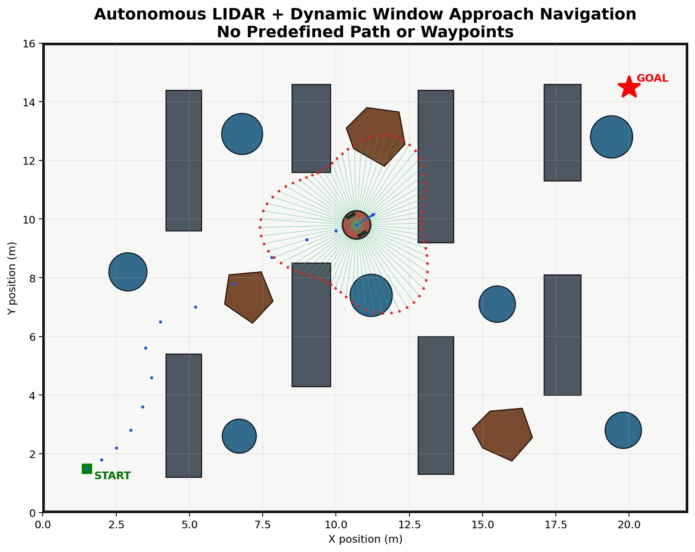
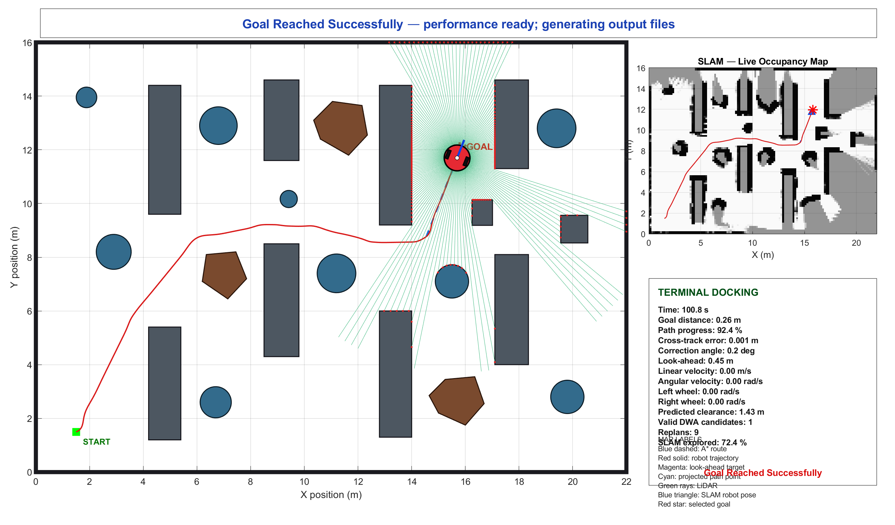
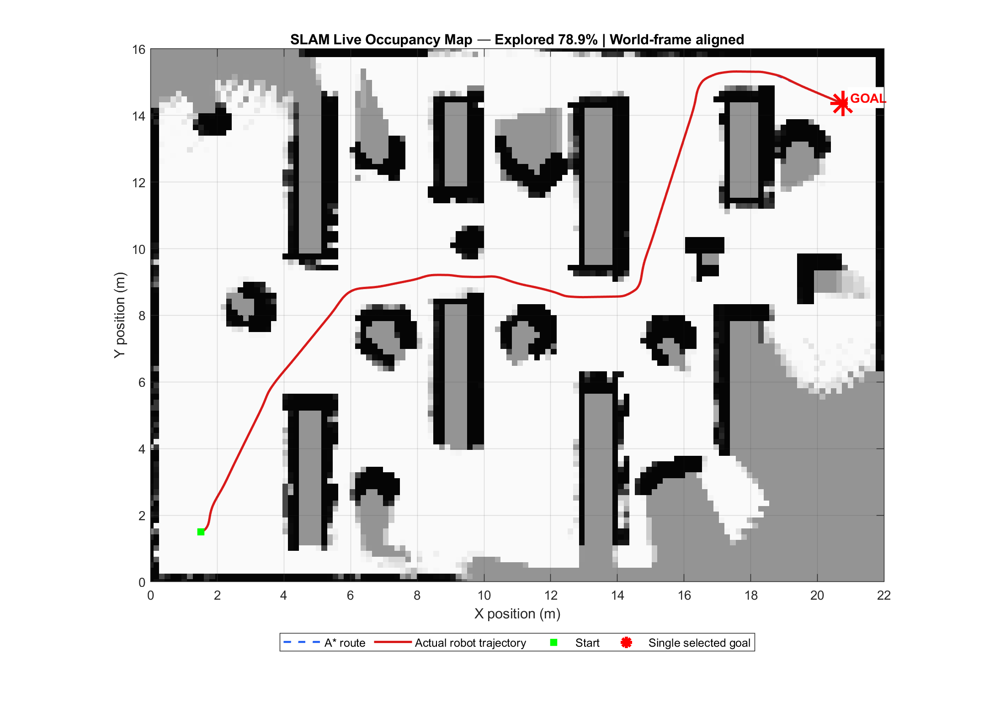
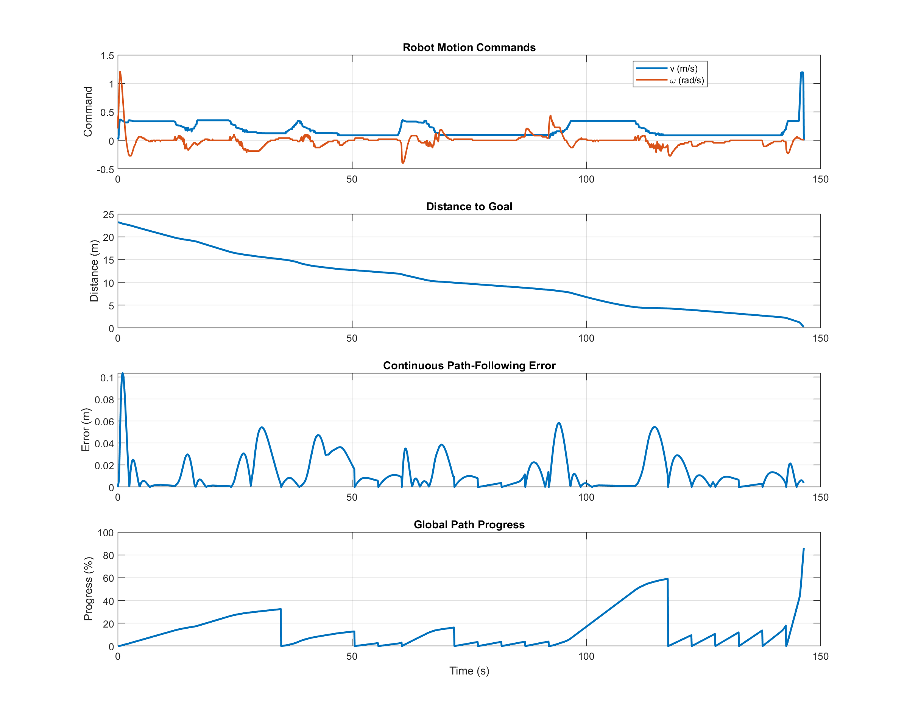

<p align="center">



</p>


<h1 align="center">
Hybrid LiDAR Navigation and Live Occupancy Mapping
</h1>


<p align="center">

A MATLAB-Based Autonomous Mobile Robot Navigation and SLAM Framework

</p>


<p align="center">


</p>


# 🤖 Project Overview


This project presents a complete autonomous mobile robot navigation framework developed in MATLAB.

The system integrates:

- A* global path planning
- Dynamic Window Approach (DWA) local control
- Differential-drive robot modelling
- 360° LiDAR simulation
- Odometry estimation
- Scan matching
- SLAM occupancy mapping
- Navigation performance evaluation


The objective is to develop a complete autonomous navigation pipeline similar to modern mobile robot systems used in robotics research.


---

# 🚗 System Architecture


```
                    Goal Position

                         |

                         ↓

                  A* Global Planner

                         |

                         ↓

                  Path Processing

                         |

                         ↓

          Dynamic Window Approach (DWA)

                         |

                         ↓

             Differential Drive Robot

             ------------------------

             |                      |

           LiDAR               Odometry

             |                      |

             ↓                      ↓

        Scan Matching -------- SLAM

                         |

                         ↓

             Live Occupancy Grid Map

```


---

# ✨ Key Features


## 🗺️ Global Path Planning

Implemented:

- A* global planner
- Obstacle-aware route generation
- Goal-directed navigation


## 🎯 Dynamic Window Approach (DWA)


The local controller performs:

- Velocity sampling
- Trajectory prediction
- Collision checking
- Clearance evaluation
- Dynamic obstacle avoidance


DWA considers:

- Robot velocity limits
- Acceleration constraints
- Goal direction
- Path alignment
- Safety clearance


---

## 👁️ LiDAR Perception


Simulated 360° LiDAR provides:

- Environment scanning
- Obstacle detection
- Range measurement
- Navigation feedback


---

## 🧭 SLAM Occupancy Mapping


SLAM pipeline:


```
LiDAR Scan

      ↓

Scan Matching

      ↓

Robot Pose Estimation

      ↓

Log-Odds Map Update

      ↓

Occupancy Grid Map
```


Implemented:

- Odometry prediction
- Scan matching
- Inverse sensor model
- Occupancy probability update
- Live map visualization


---

# 🎬 Demo Video


## Autonomous SLAM Navigation Simulation


▶️ A* Route Animation:


```
astar_route_animation.avi
```


The simulation demonstrates:


- A* search process
- Global path generation
- DWA local navigation
- LiDAR perception
- SLAM map generation
- Autonomous robot movement


---

# 📸 Simulation Results


## Project Preview


<p align="center">


</p>


Overview of the complete autonomous navigation framework.


---


## Final Hybrid Navigation Result


<p align="center">



</p>


The hybrid navigation result demonstrates:


- A* global path
- DWA local trajectory
- Robot motion
- Obstacle avoidance
- Navigation completion


---


## Live SLAM Occupancy Map


<p align="center">



</p>


The SLAM map demonstrates:


- LiDAR-based perception
- Occupancy grid generation
- Free space
- Unknown regions
- Occupied obstacles
- Robot localization


---


## Navigation Performance Analysis


<p align="center">



</p>


Performance evaluation includes:


- Velocity profile
- Tracking behaviour
- Navigation stability
- Motion performance


---

# 🧠 Algorithms Implemented


## 1. A* Global Path Planner


A* is used for global route generation.


Advantages:

- Complete grid search
- Optimal path selection
- Obstacle avoidance
- Efficient route planning


---

## 2. Dynamic Window Approach (DWA)


DWA selects safe velocity commands from possible robot trajectories.


Trajectory evaluation:


```
Trajectory Score =

Goal Progress

+

Path Alignment

+

Obstacle Clearance

-

Motion Cost
```


Features:


- Local obstacle avoidance
- Velocity optimization
- Collision prevention
- Dynamic navigation


---

## 3. Differential Drive Robot Model


Robot motion model:


```
Linear Velocity  → Forward Motion

Angular Velocity → Rotation Control
```


The system considers:


- Maximum velocity
- Acceleration limits
- Turning constraints


---

## 4. LiDAR Based SLAM


Mapping process:


```
Sensor Data

     ↓

Scan Matching

     ↓

Pose Estimation

     ↓

Occupancy Update

     ↓

Map Generation
```


---

# 📂 Project Structure


```
slam_live_occupancy_map

│
├── main.m
│
├── planning
│   └── planPathAStar.m
│
├── control
│   ├── dynamicWindowApproach.m
│   └── evaluateTrajectory.m
│
├── mapping
│   ├── initializeSlamMap.m
│   └── updateSlamMap.m
│
├── sensing
│   └── simulateLidar.m
│
├── robot
│   └── robotKinematics.m
│
├── project_preview.png
├── final_hybrid_navigation.png
├── slam_live_occupancy_map.png
├── hybrid_navigation_performance.png
├── astar_route_animation.avi
│
├── PROJECT_REPORT.md
└── LICENSE

```


---

# ⚙️ Requirements


Software:


- MATLAB R2020a or newer


Recommended:


- MATLAB Robotics Toolbox


---

# 🚀 Running the Simulation


Clone repository:


```bash
git clone https://github.com/ruddrho/slam_live_occupancy_map.git
```


Open MATLAB:


```matlab
main
```


The simulation generates:


- Robot trajectory
- Occupancy map
- Navigation results
- Performance analysis


---

# 📊 Evaluation Metrics


| Metric | Description |
|---|---|
| Path Length | Total travelled distance |
| Goal Error | Final position accuracy |
| Tracking Error | Navigation accuracy |
| Clearance | Obstacle safety distance |
| Mission Time | Navigation efficiency |
| Replanning | Controller response |


---

# 🔬 Future Development Roadmap


The next stage is migration from MATLAB simulation to a complete ROS2 robotic platform.


## ROS2 Jazzy + Gazebo Harmonic Architecture


```
ROS2 Jazzy

      ↓

Gazebo Harmonic Simulation

      ↓

URDF Robot Model

      ↓

ros2_control

      ↓

LiDAR + IMU + Encoder

      ↓

SLAM Toolbox

      ↓

Nav2 Navigation Stack

      ↓

Real Robot Deployment

```


Future improvements:


- ROS2 C++ implementation
- Gazebo Harmonic simulation
- Nav2 integration
- SLAM Toolbox
- EKF sensor fusion
- Real LiDAR testing
- Hardware deployment


---

# 🎓 Academic Relevance


This project demonstrates:


- Autonomous mobile robotics
- Motion planning
- Feedback control
- LiDAR perception
- SLAM implementation
- Navigation optimization


Suitable for:


- Robotics Master's Portfolio
- Control Systems Research
- Autonomous Systems Development


---

# 📖 Citation


```
Ruddrho Mollik,

Hybrid LiDAR Navigation and Live Occupancy Mapping
for Autonomous Mobile Robots.

MATLAB Robotics Simulation Project.
```


---

# 📜 License


This project is licensed under the MIT License.


---

# 👨‍💻 Author


## Ruddrho Mollik


Research Interests:


- Autonomous Mobile Robots
- SLAM
- Motion Planning
- Control Systems
- Robotics Software
- Autonomous Navigation
